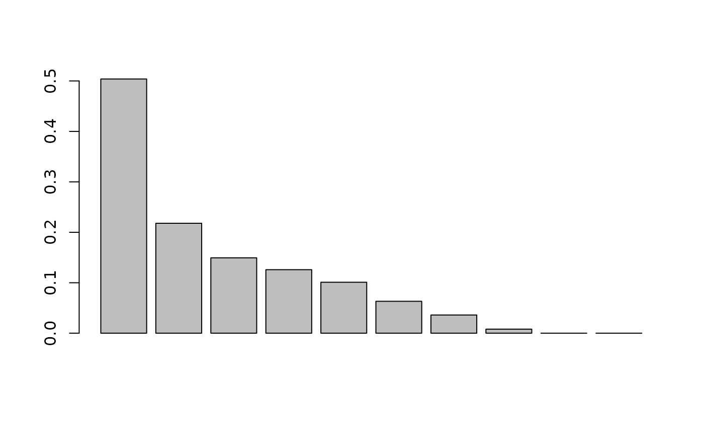
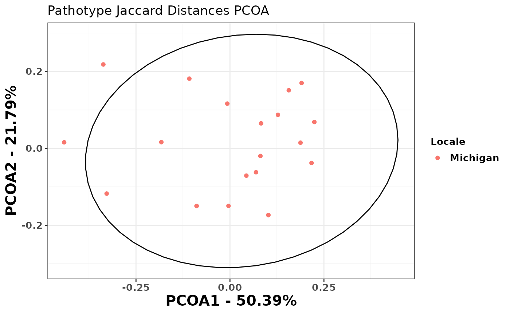
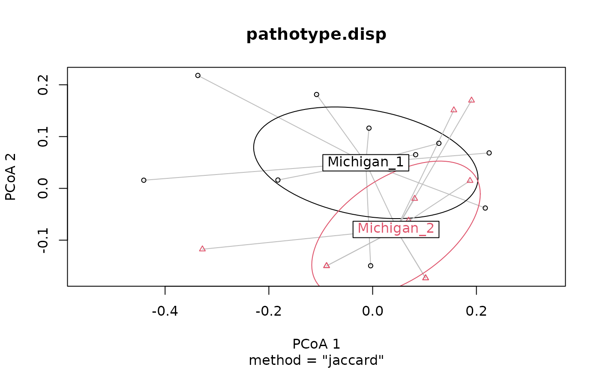

# Beta-diversity Analysis with hagis

## Load Packages

These packages are necessary for this analysis to be conducted.

``` r

library("ape")
library("vegan")
library("dplyr")
library("hagis")
library("ggplot2")
```

Import the data to be used in analysis. These example data are included
in {hagis} and so when loading {hagis} they become available in your R
session.

``` r

head(P_sojae_survey) # survey sample data
```

    ##    Isolate         Line         Rps Total HR (1) Lesion (2)
    ##      <int>       <char>      <char> <int>  <int>      <int>
    ## 1:       1     Williams susceptible    10      0          0
    ## 2:       1       Harlon      Rps 1a    10      4          0
    ## 3:       1 Harosoy 13xx      Rps 1b     8      0          0
    ## 4:       1     L75-3735      Rps 1c    10     10          0
    ## 5:       1    PI 103091      Rps 1d     9      2          0
    ## 6:       1  Williams 82      Rps 1k    10      0          0
    ##    Lesion to cotyledon (3) Dead (4) total.susc total.resis perc.susc perc.resis
    ##                      <int>    <int>      <int>       <int>     <int>      <int>
    ## 1:                       0       10         10           0       100          0
    ## 2:                       0        6          6           4        60         40
    ## 3:                       0        8          8           0       100          0
    ## 4:                       0        0          0          10         0        100
    ## 5:                       1        6          7           2        78         22
    ## 6:                       0       10         10           0       100          0

``` r

head(sample_meta) # metatada about the sample collection locations
```

    ##   Sample   Locale
    ## 1      1 Michigan
    ## 2     10 Michigan
    ## 3     11 Michigan
    ## 4     12 Michigan
    ## 5     13 Michigan
    ## 6     14 Michigan

This removes the “MPS17\_” from the isolates, so that they will be read
as numeric instead of character. The next step removes the “Rps” from
the gene names, so that they will be read as numeric instead of
character.

``` r

P_sojae_survey$Isolate <-
  gsub(pattern = "MPS17_",
       replacement = "",
       x = P_sojae_survey$Isolate)
P_sojae_survey$Rps <-
  gsub(pattern = "Rps ",
       replacement = "",
       x = P_sojae_survey$Rps)
```

Set up the {hagis} arguments for analysis. Please see
[`vignette("hagis")`](https://openplantpathology.github.io/hagis/articles/hagis.md)
for more details on how to specify arguments for the functions in this
package.

``` r

hagis_args <- list(
  x = P_sojae_survey,
  cutoff = 60,
  control = "susceptible",
  sample = "Isolate",
  gene = "Rps",
  perc_susc = "perc.susc"
)
```

## Convert the Dataset to a Binary Data Matrix

Using
[`create_binary_matrix()`](https://openplantpathology.github.io/hagis/reference/create_binary_matrix.md)
transforms the data so that it is in the correct format (binary data
matrix) for PCOA analysis.

``` r

P_sojae_survey.matrix <- do.call(create_binary_matrix, hagis_args)

P_sojae_survey.matrix
```

    ##    1a 1b 1c 1d 1k 2 3a 3b 3c 4 5 6 7
    ## 1   1  1  0  1  1 1  1  1  0 0 1 1 1
    ## 10  1  0  1  0  0 0  0  1  0 0 1 0 1
    ## 11  1  0  1  0  0 0  0  1  0 0 1 1 1
    ## 12  1  1  1  1  1 1  0  0  0 0 0 1 1
    ## 13  1  1  1  1  1 0  0  1  0 0 0 0 1
    ## 14  1  1  1  0  1 0  0  1  0 0 1 1 1
    ## 15  1  1  1  1  1 1  0  1  0 1 1 1 1
    ## 16  1  1  1  0  1 0  0  1  0 0 1 0 1
    ## 17  1  1  1  1  1 1  0  1  0 1 1 0 1
    ## 18  1  1  1  1  1 0  1  1  0 0 1 1 1
    ## 19  1  1  1  1  1 1  1  1  1 0 0 1 1
    ## 2   1  1  1  0  1 1  0  1  1 1 0 1 1
    ## 20  1  1  1  1  1 1  1  1  1 0 1 0 1
    ## 21  1  1  1  1  1 1  1  1  1 1 1 1 1
    ## 3   1  1  1  1  1 1  0  1  0 1 0 1 1
    ## 4   1  0  1  1  1 1  0  1  0 0 1 0 1
    ## 5   1  0  1  1  1 1  0  1  0 0 0 1 1
    ## 6   1  0  1  1  1 1  0  1  0 0 1 0 1
    ## 7   1  1  1  1  1 1  0  1  0 0 0 0 1
    ## 8   1  1  1  1  1 1  0  1  0 0 0 0 1
    ## 9   1  0  1  1  0 0  0  1  0 0 1 0 1

The `P_sojae_survey.matrix` object contains the RPS genes numbered as
rows and the columns are numbered isolates. A “1” indicates the isolate
caused disease on the RPS gene, and a “0” means it did not.

## Perform Principle Coordinates Analysis (PCOA)

The following code will transpose the `P_sojae_survey.matrix` and then
calculate the Jaccard distances for each isolate. Jaccard distance
calculations need to be used as pathotype data is presence/absence for
virulence. Lastly, PCOA is performed to identify the variance explained
by each principal coordinate. This will be used later to visualize and
identify distance pathotype groupings by geographic location. In this
example, Jaccard distances are used as this is presence/absence data.

``` r

P_sojae_survey.matrix.jaccard <-
  vegdist(P_sojae_survey.matrix, "jaccard", na.rm = TRUE)
```

After performing the principal coordinates analysis, we see that the
scree plot says that about 70% of the variation in Jaccard distances are
explained within the first two dimensions (*i.e.*, axes). This is good.
Usually a good rule of thumb is that if the second dimension is roughly
half variation explained in the first dimension you don’t need to look
further at the third or n+1 dimensions.

``` r

princoor.pathotype <- pcoa(P_sojae_survey.matrix.jaccard) 

barplot(princoor.pathotype$values$Relative_eig[1:10])
```



Now we can calculate the percentage of variation that each principal
coordinate accounts for. Another way to calculate the percent variation
is to look at the `Relative_eig` column.

``` r

# Dimension (i.e., Axis 1 (PCOA1))
Axis1.percent <-
  princoor.pathotype$values$Relative_eig[[1]] * 100

# Dimension (i.e., Axis 2 (PCOA2))
Axis2.percent <-
  princoor.pathotype$values$Relative_eig[[2]] * 100

Axis1.percent
```

    ## [1] 50.39109

``` r

Axis2.percent
```

    ## [1] 21.79118

Now we can make a data frame with the two principal coordinates that
account for the most variation in the data. We will then add metadata to
the data frame `pca.data`.

``` r

princoor.pathotype.data <-
  data.frame(
    Sample = as.integer(rownames(princoor.pathotype$vectors)),
    X = princoor.pathotype$vectors[, 1],
    Y = princoor.pathotype$vectors[, 2]
  )
```

## Add Metadata to your PCOA Data

You will need to add information on the sample collection location or
other data to help identify different pathotype groupings based on
geographic location or other factors. We will use
[`left_join()`](https://dplyr.tidyverse.org/reference/mutate-joins.html)
from {dplyr} to combine the `princoor.pathotype.data` with the metadata
that we’ve already loaded, `sample_meta` that contains a geographic
location (state name).

``` r

princoor.pathotype.data <-
  left_join(princoor.pathotype.data, sample_meta, by = "Sample")

princoor.pathotype.data
```

    ##    Sample            X           Y   Locale
    ## 1       1  0.127655783  0.08704548 Michigan
    ## 2      10 -0.441075005  0.01573886 Michigan
    ## 3      11 -0.336826428  0.21804192 Michigan
    ## 4      12  0.217071376 -0.03795693 Michigan
    ## 5      13 -0.003862869 -0.14942952 Michigan
    ## 6      14 -0.108034781  0.18124849 Michigan
    ## 7      15  0.082862290  0.06501932 Michigan
    ## 8      16 -0.182559838  0.01610323 Michigan
    ## 9      17  0.043684771 -0.07086878 Michigan
    ## 10     18 -0.007048533  0.11629976 Michigan
    ## 11     19  0.224528803  0.06847162 Michigan
    ## 12      2  0.190565779  0.16984304 Michigan
    ## 13     20  0.081014587 -0.01986841 Michigan
    ## 14     21  0.156490576  0.15103874 Michigan
    ## 15      3  0.187665103  0.01477482 Michigan
    ## 16      4 -0.088772478 -0.14970662 Michigan
    ## 17      5  0.069295886 -0.06198926 Michigan
    ## 18      6 -0.088772478 -0.14970662 Michigan
    ## 19      7  0.102108599 -0.17330058 Michigan
    ## 20      8  0.102108599 -0.17330058 Michigan
    ## 21      9 -0.328099742 -0.11749798 Michigan

Now we will plot the PCA data using {ggplot2} and color the points based
on location, `Locale`, and identify the 95% confidence interval of those
groups using the
[`stat_ellipse()`](https://ggplot2.tidyverse.org/reference/stat_ellipse.html)
function.

``` r

ggplot(data = princoor.pathotype.data, aes(x = X, y = Y)) +
  geom_point(aes(colour = Locale)) +
  xlab(paste("PCOA1 - ", round(Axis1.percent, 2), "%", sep = "")) +
  ylab(paste("PCOA2 - ", round(Axis2.percent, 2), "%", sep = "")) +
  theme_bw() +
  theme(
    axis.title.x = element_text(face = "bold", size = 15),
    axis.title.y = element_text(face = "bold", size = 15),
    axis.text = element_text(face = "bold", size = 10),
    legend.title = element_text(face = "bold", size = 10),
    legend.text = element_text(face = "bold", size = 10),
    legend.key.size = unit(1, 'lines')
  ) +
  stat_ellipse(data = princoor.pathotype.data, aes(x = X, y = Y),
               level = 0.95) +
  ggtitle("Pathotype Jaccard Distances PCOA")
```



## Statistical Tests for Beta Diversity

When using two or more pathotype datasets for comparisons, you can use
beta-diversity tests to identify if there are significant differences
between their sampled pathotype compositions. These code are presented
as an example for further downstream analysis that can be used when
comparing two or more populations’ pathotype composition.

In these examples we will artificially split the dataset into two, so
that these analyses can be shown. When performing your own analyses you
will likely have two geographic locations to compare already. Make sure
you can differentiate these populations with the metadata file used
previously (*i.e.*, column in the dataset that specifies where the
isolate came from; USA, Brazil, China, Australia, etc.).

## Permutation Based Analysis of Variance (PERMANOVA) and Beta-dispersion Analyses

### Beta-Dispersion

Beta-dispersion tests if the dispersion, variance, of two or more groups
are significantly different or not. First, an item named “groups” must
be made that contains lists of the location and number of isolates from
that location used in the analysis. We will then check to make sure the
lists in “groups” adds up to the number of isolated used in analysis.

First, make a list of the locations for each pathotype. Note that when
you are using two or more locations you will need to make a list for
each location with a length of isolates used.

``` r

groups <- factor(c(rep("Michigan_1", 11), rep("Michigan_2", 10)))

# this number shows how many isolates are in all "groups" lists combined
length(groups)
```

    ## [1] 21

``` r

# this shows the number of isolates within your data set, these numbers should
# match for downstream analyses to work!! 
length(unique(P_sojae_survey$Isolate))
```

    ## [1] 21

Next, beta-dispersion will be calculated using the Jaccard distance
matrix made previously. An ANOVA is then performed to identify
significance within the dataset. Post-hoc tests can be used to identify
significant interactions between specific locations within the dataset.
This can then be plotted to visualize how the beta-dispersion is
different between groups.

``` r

 # calculates the beta-dispersion for each group, when comparing 2 or more
pathotype.disp <-
  betadisper(P_sojae_survey.matrix.jaccard, groups)

# tests if centroid distances are significantly different from each other
pathotype.disp.anova <- anova(pathotype.disp) 
pathotype.disp.anova
```

    ## Analysis of Variance Table
    ## 
    ## Response: Distances
    ##           Df   Sum Sq   Mean Sq F value Pr(>F)
    ## Groups     1 0.008375 0.0083752  0.9672 0.3377
    ## Residuals 19 0.164523 0.0086591

``` r

# test significance between each group
pathotype.disp.TukeyHSD <- TukeyHSD(pathotype.disp)
pathotype.disp.TukeyHSD
```

    ##   Tukey multiple comparisons of means
    ##     95% family-wise confidence level
    ## 
    ## Fit: aov(formula = distances ~ group, data = df)
    ## 
    ## $group
    ##                              diff        lwr        upr     p adj
    ## Michigan_2-Michigan_1 -0.03998626 -0.1250853 0.04511275 0.3377355

``` r

# plot showing the dispersion for each group
plot(pathotype.disp, hull = FALSE, ellipse = TRUE)
```



The ANOVA identified no significant differences between groups
dispersion (p = 0.3377355). This means that the groups dispersion, or
variance, is not significantly different from each other and the groups
dispersion is likely homogeneous between groups. At this point, a Tukey
HSD test is not warranted, but we use it as an example here. Again, a
p-value of 0.3377355 is reported from the Tukey HSD tests and we reject
the hypothesis that these groups may have different dispersion. We can
plot the dispersion for each group using the
[`plot()`](https://rdrr.io/r/graphics/plot.default.html) function. As
expected, since we have identified no significant differences, the two
groups dispersion overlap a great deal and are not distinct from each
other. Again this shows that pathotype dispersion between the groups is
homogeneous and not different in this instance.

If we were working with a data set that had groups with significantly
different dispersion we would expect to see a significant ANOVA p-value
(p \< 0.05) as well as significance when using the Tukey HSD test.
Lastly, the plotted dispersion will form distinct, separate, groups
which can be observed.

Differences in beta-dispersion may indicate separate pathotype groups
which should be further investigated with Permutation Based Analysis of
Variance (PERMANOVA) and Analysis of Similarity (ANOSIM) analysis.
Groups which have similar dispersion may still be significantly
different in regards to their centroids, which will be tested using a
PERMANOVA.

### Permutation Based Analysis of Variance (PERMANOVA)

PERMANOVA tests if the centroids, similar to means, of each group are
significantly different from each other. Likewise, an $`R^2`$ statistic
is calculated, showing the percentage of the variance explained by the
groups.

``` r

pathotype.adonis <- adonis2(P_sojae_survey.matrix.jaccard ~ groups)

pathotype.adonis
```

    ## Permutation test for adonis under reduced model
    ## Permutation: free
    ## Number of permutations: 999
    ## 
    ## adonis2(formula = P_sojae_survey.matrix.jaccard ~ groups)
    ##          Df SumOfSqs      R2      F Pr(>F)
    ## Model     1  0.11358 0.07869 1.6229  0.184
    ## Residual 19  1.32976 0.92131              
    ## Total    20  1.44335 1.00000

The PERMANOVA identified no significant differences between the groups
centroids, or means (*p* = 0.184). In addition to identifying
significance between group centroids, the PERMANOVA also calculates how
much of the variance can be explained by the specified groups (see the
$`R^2`$ column in the PERMANOVA output). In this case, the $`R^2`$ is
0.0786944, so 7.9% of the variance is explained by the groups used in
analysis. Based on the PERMANOVA results we can conclude that these two
groups are not different from each other and likely have similar
pathotypes to each other.

### Analysis of Similarity (ANOSIM)

ANOSIM statistic (R) ranges from between -1 and 1. Positive numbers
suggest that there is more similarity within groups than there is
between groups. Values close to zero indicate no difference between
groups (*i.e.*, similarities are the same between groups).

``` r

pathotype.anosim <- anosim(P_sojae_survey.matrix.jaccard, groups)

pathotype.anosim
```

    ## 
    ## Call:
    ## anosim(x = P_sojae_survey.matrix.jaccard, grouping = groups) 
    ## Dissimilarity: jaccard 
    ## 
    ## ANOSIM statistic R: 0.06882 
    ##       Significance: 0.151 
    ## 
    ## Permutation: free
    ## Number of permutations: 999

ANOSIM statistic (R) was 0.0688182, so there are more similarities
between groups than there are within groups. This is evidence that the
groups are not different from one another. Likewise the significance is
\>0.05 so there is no significant difference between groups’
similarities.
