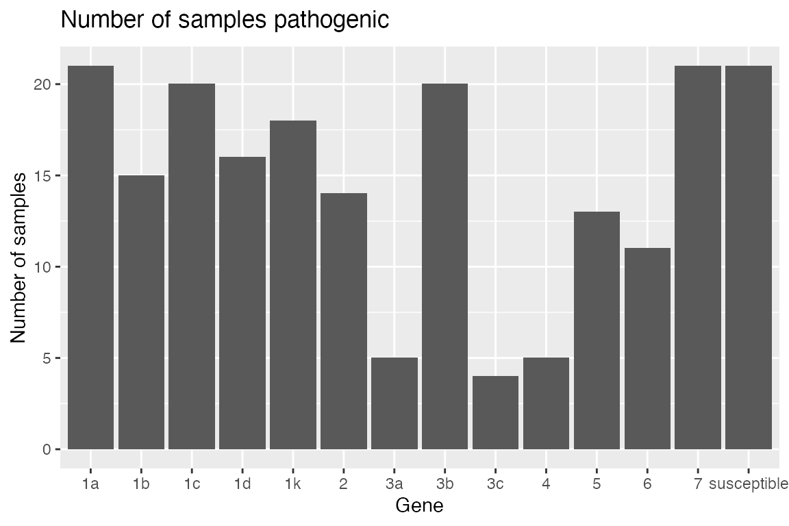
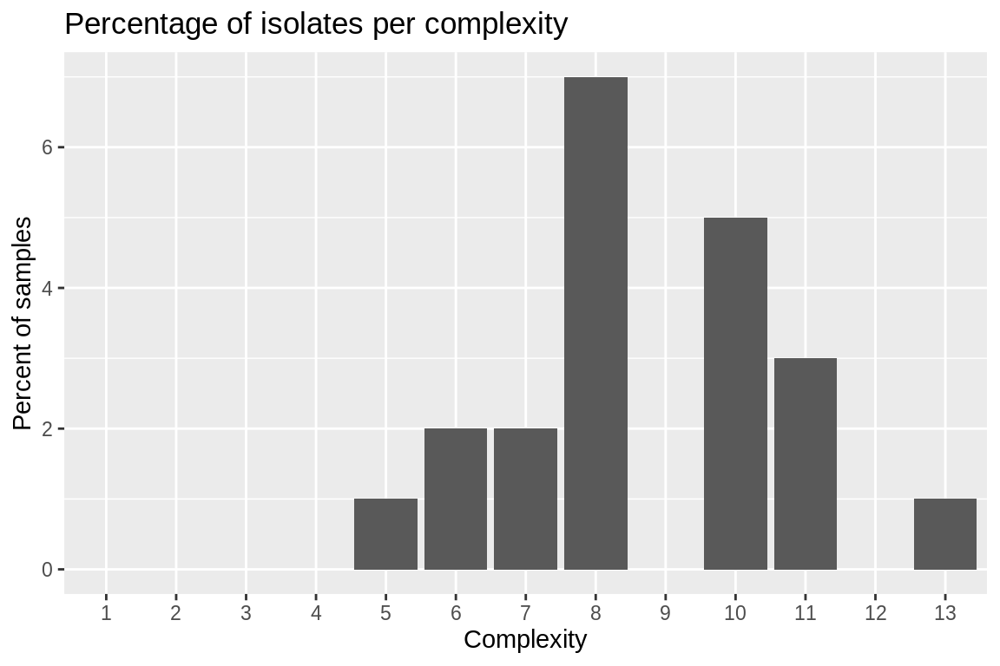
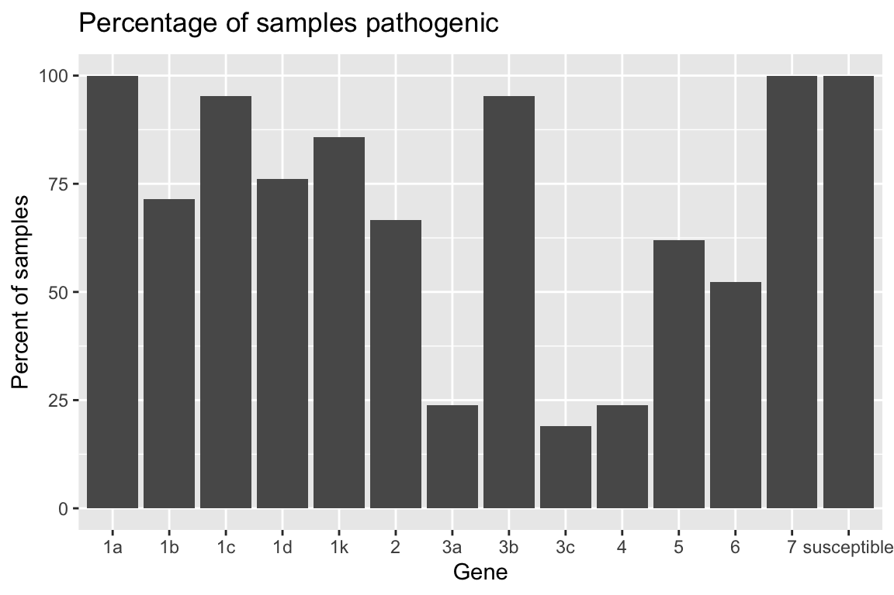
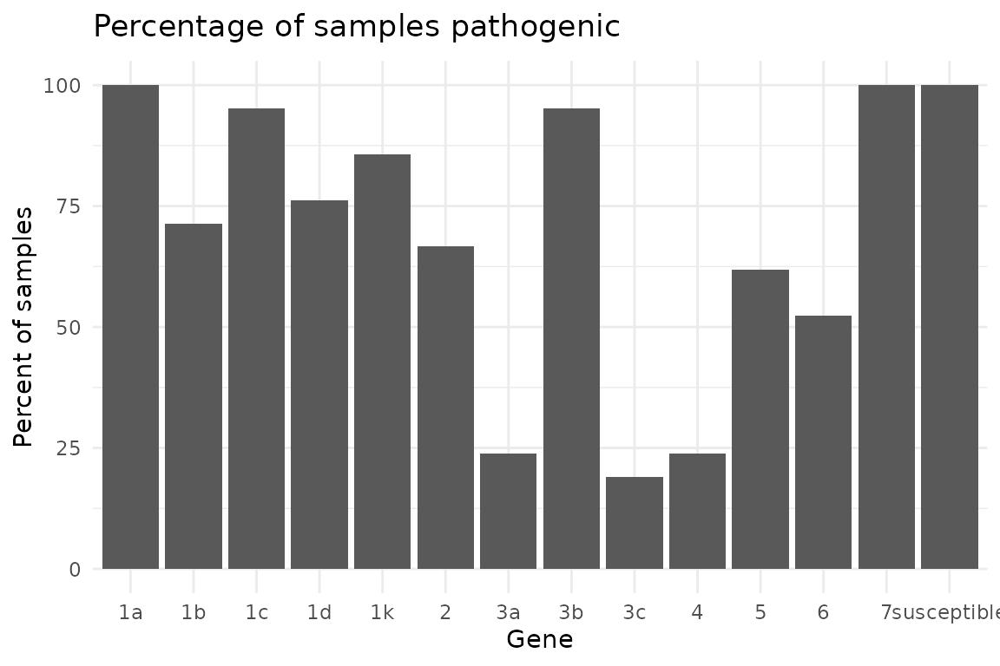
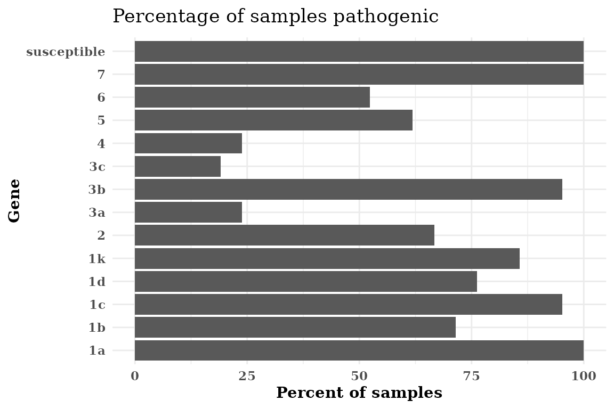
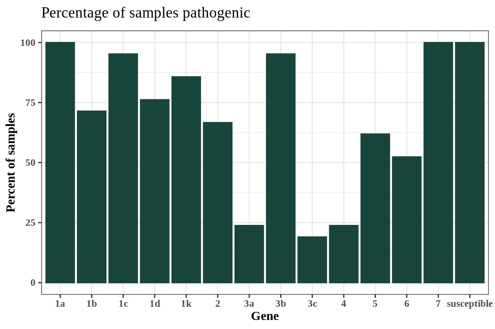
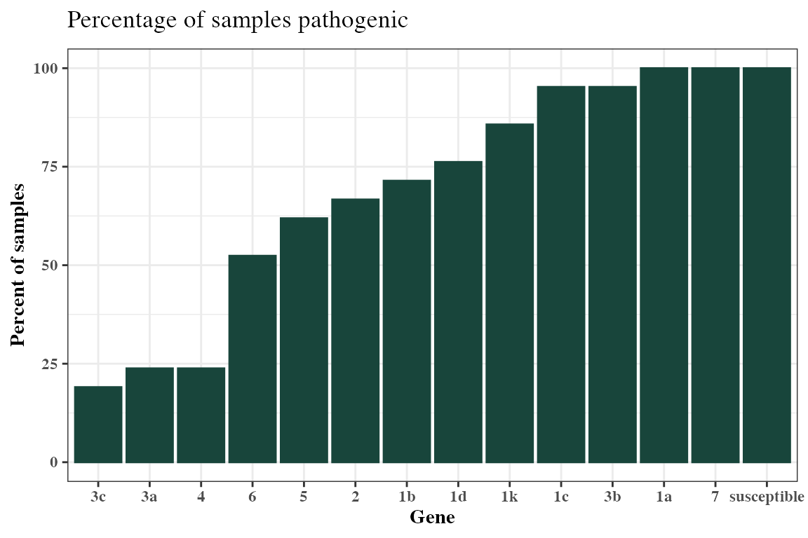

# hagis: Tools for Analysis of Plant Pathogen Pathotype Complexities, Distributions and Diversity

### Getting Started With {hagis}

The following examples are based on a dataset from Michigan State
University *Phytophthora sojae* surveys for soybean phytophthora root
rot pathotyping efforts.

First you’ll want to load in your data set, for right now let’s use a
practice data set made for the {hagis} package, named `P_sojae_survey`.
The data set is available in your R session automatically when you load
the {hagis} package.

``` r

library("hagis")
head(P_sojae_survey)
#>    Isolate         Line         Rps Total HR (1) Lesion (2)
#>      <int>       <char>      <char> <int>  <int>      <int>
#> 1:       1     Williams susceptible    10      0          0
#> 2:       1       Harlon      Rps 1a    10      4          0
#> 3:       1 Harosoy 13xx      Rps 1b     8      0          0
#> 4:       1     L75-3735      Rps 1c    10     10          0
#> 5:       1    PI 103091      Rps 1d     9      2          0
#> 6:       1  Williams 82      Rps 1k    10      0          0
#>    Lesion to cotyledon (3) Dead (4) total.susc total.resis perc.susc perc.resis
#>                      <int>    <int>      <int>       <int>     <int>      <int>
#> 1:                       0       10         10           0       100          0
#> 2:                       0        6          6           4        60         40
#> 3:                       0        8          8           0       100          0
#> 4:                       0        0          0          10         0        100
#> 5:                       1        6          7           2        78         22
#> 6:                       0       10         10           0       100          0
```

We see in the `gene` column that each gene is prepended with “Rps”. We
can remove this to make the graphs cleaner and report the genes in
tables as we would in a manuscript. Note that this will work for any
string you enter as the first value, `pattern`. The second string,
`replacement`, is the replacement value, the third, `x`, is where to
look and make the changes.

``` r

P_sojae_survey$Rps <-
  gsub(
    pattern = "Rps ",
    replacement = "",
    x = P_sojae_survey$Rps
  )
head(P_sojae_survey)
#>    Isolate         Line         Rps Total HR (1) Lesion (2)
#>      <int>       <char>      <char> <int>  <int>      <int>
#> 1:       1     Williams susceptible    10      0          0
#> 2:       1       Harlon          1a    10      4          0
#> 3:       1 Harosoy 13xx          1b     8      0          0
#> 4:       1     L75-3735          1c    10     10          0
#> 5:       1    PI 103091          1d     9      2          0
#> 6:       1  Williams 82          1k    10      0          0
#>    Lesion to cotyledon (3) Dead (4) total.susc total.resis perc.susc perc.resis
#>                      <int>    <int>      <int>       <int>     <int>      <int>
#> 1:                       0       10         10           0       100          0
#> 2:                       0        6          6           4        60         40
#> 3:                       0        8          8           0       100          0
#> 4:                       0        0          0          10         0        100
#> 5:                       1        6          7           2        78         22
#> 6:                       0       10         10           0       100          0
```

This practice data set contains 21 isolates’, `Isolate`, virulence data
on a set of 14 differential soybean cultivars, `Line`. This package uses
the *percentage* of susceptible, inoculated, plants to determine
effective resistance genes, pathotype diversity and frequency, as well
as individual isolates pathotypes.

To help ensure that the proper data are used in calculations, the user
is asked to provide some information that instruct {hagis} about what
data to use.

------------------------------------------------------------------------

### Function Arguments Used in {hagis}

We have striven to make {hagis} as intuitive to use as possible. Part of
that means that we have used the same arguments for the three main
functions,
[`summarize_gene()`](https://openplantpathology.github.io/hagis/reference/summarize_gene.md),
[`calculate_complexities()`](https://openplantpathology.github.io/hagis/reference/calculate_complexities.md)
and
[`calculate_diversities()`](https://openplantpathology.github.io/hagis/reference/calculate_diversities.md).
Each of these functions take the same arguments:

- `x` this is your data set name, *e.g.*, `P_sojae_survey` from the
  example above, allows for the function to identify where it will be
  pulling these columns (and their associated row values) from to use
  (*i.e.* your data collection Excel spreadsheet)

- `cutoff` this value sets the cutoff for susceptible reactions. For
  example, `cutoff = 60` means that all genes with 60% or more of the
  plants rated susceptible will be treated as susceptible. You can
  change this to whatever percentage you require for your study.

- `control` specifies the value used in the `gene` column to denote a
  susceptible control used in the study

- `sample` specifies the column header for the column which identifies
  the isolates tested

- `gene` specifies the column header for the column which identifies the
  genes tested

- `perc_susc` specifies the column header for the column which
  identifies the percent susceptible plants for each gene

Ordinarily you would use functions in {hagis} or other R packages like
this:

``` r

Rps.summary <- summarize_gene(
  x = P_sojae_survey,
  cutoff = 60,
  control = "susceptible",
  sample = "Isolate",
  gene = "Rps",
  perc_susc = "perc.susc"
)
```

However, because the functions share arguments we can create a
[`list()`](https://rdrr.io/r/base/list.html) of arguments and share them
with some of the functions from {hagis}. First, we make a list of the
arguments that
[`summarize_gene()`](https://openplantpathology.github.io/hagis/reference/summarize_gene.md),
[`calculate_diversities()`](https://openplantpathology.github.io/hagis/reference/calculate_diversities.md)
and
[`calculate_complexities()`](https://openplantpathology.github.io/hagis/reference/calculate_complexities.md)
use that specify our inputs based on our example data:

``` r

hagis_args <- list(
  x = P_sojae_survey,
  cutoff = 60,
  control = "susceptible",
  sample = "Isolate",
  gene = "Rps",
  perc_susc = "perc.susc"
)
```

Now that we have a list of arguments, we can now save time entering the
same data for each function and also avoid typos or entering different
cutoff values, etc. between the functions.

------------------------------------------------------------------------

### Determination of Effective Resistance Genes

Below is an example of tables and graphics that can be produced using
the
[`summarize_gene()`](https://openplantpathology.github.io/hagis/reference/summarize_gene.md)
function to identify effective resistance genes tested against the
sampled *Phytophthora sojae* population.

The
[`summarize_gene()`](https://openplantpathology.github.io/hagis/reference/summarize_gene.md)
function allows you to produce a detailed table showing the number of
virulent isolates (`N_virulent_isolates`), as well as offering a
percentage of the isolates tested which are pathogenic on each gene
(`percent_pathogenic`).

``` r

Rps.summary <- do.call(summarize_gene, hagis_args)

Rps.summary
#>            gene N_virulent_isolates percent_pathogenic
#>          <char>               <num>              <num>
#>  1: susceptible                  21          100.00000
#>  2:          1a                  21          100.00000
#>  3:          1b                  15           71.42857
#>  4:          1c                  20           95.23810
#>  5:          1d                  16           76.19048
#>  6:          1k                  18           85.71429
#>  7:           2                  14           66.66667
#>  8:          3a                   5           23.80952
#>  9:          3b                  20           95.23810
#> 10:          3c                   4           19.04762
#> 11:           4                   5           23.80952
#> 12:           5                  13           61.90476
#> 13:           6                  11           52.38095
#> 14:           7                  21          100.00000
```

Using the *pander* library we can make the table much more attractive in
RMarkdown.

``` r

library(pander)

pander(Rps.summary)
```

|    gene     | N_virulent_isolates | percent_pathogenic |
|:-----------:|:-------------------:|:------------------:|
| susceptible |         21          |        100         |
|     1a      |         21          |        100         |
|     1b      |         15          |       71.43        |
|     1c      |         20          |       95.24        |
|     1d      |         16          |       76.19        |
|     1k      |         18          |       85.71        |
|      2      |         14          |       66.67        |
|     3a      |          5          |       23.81        |
|     3b      |         20          |       95.24        |
|     3c      |          4          |       19.05        |
|      4      |          5          |       23.81        |
|      5      |         13          |        61.9        |
|      6      |         11          |       52.38        |
|      7      |         21          |        100         |

#### Plotting Rps Summary Data

{hagis} also provides functions to quickly graph your data using
{ggplot2}.

Two functions are provided to plot the summary depending on your needs.
If you need the frequency, use
`autoplot(Rps.summary, type = "percentage")`, or if you desire the
distribution `autoplot(Rps.summary, type = "count")`. Both return the
same graph, only the y-axis change; percent for frequency and n for
distribution.

``` r

autoplot(Rps.summary, type = "percentage")
```


``` r


autoplot(Rps.summary, type = "count")
```



------------------------------------------------------------------------

### Pathotype Complexities

Pathotype frequency, distribution as well as statistics such as mean
pathotype complexity can be calculated using the
[`calculate_complexities()`](https://openplantpathology.github.io/hagis/reference/calculate_complexities.md)
function. This function will return a
[`list()`](https://rdrr.io/r/base/list.html) of two `data.table()`
objects, `grouped_complexities` and `individual_complexities`.
`grouped_complexities` returns a
[`list()`](https://rdrr.io/r/base/list.html) as a `data.table()` object
showing the frequency and distribution of pathotype complexities for the
sampled population. `individual_complexities()` returns a
[`list()`](https://rdrr.io/r/base/list.html) as a `data.table()` object
showing each individual isolates pathotype complexity. An isolates
pathotype complexity refers to the number of resistance genes that it is
able to overcome and cause disease on, *i.e.*, a pathotype complexity of
“7” would mean that isolate can cause disease on 7 different resistance
genes.

``` r

complexities <- do.call(calculate_complexities, hagis_args)

complexities
#> 
#> Grouped Complexities
#>     complexity frequency distribution
#>         <fctr>     <int>        <int>
#>  1:          1         0            0
#>  2:          2         0            0
#>  3:          3         0            0
#>  4:          4         0            0
#>  5:          5         1            1
#>  6:          6         2            2
#>  7:          7         2            2
#>  8:          8         7            7
#>  9:          9         0            0
#> 10:         10         5            5
#> 11:         11         3            3
#> 12:         12         0            0
#> 13:         13         1            1
#> 
#> 
#> Individual Complexities
#>     sample N_samp
#>     <char>  <num>
#>  1:      1     10
#>  2:      2     10
#>  3:      3     10
#>  4:      4      8
#>  5:      5      8
#>  6:      6      8
#>  7:      7      8
#>  8:      8      8
#>  9:      9      6
#> 10:     10      5
#> 11:     11      6
#> 12:     12      8
#> 13:     13      7
#> 14:     14      8
#> 15:     15     11
#> 16:     16      7
#> 17:     17     10
#> 18:     18     10
#> 19:     19     11
#> 20:     20     11
#> 21:     21     13
#>     sample N_samp
#>     <char>  <num>
```

Once again, using *pander* we can make these tables much more attractive
in RMarkdown. Since `complexities` is a
[`list()`](https://rdrr.io/r/base/list.html) object, we can refer to
each object directly by name and print them as follows.

``` r

pander(complexities$grouped_complexities)
```

| complexity | frequency | distribution |
|:----------:|:---------:|:------------:|
|     1      |     0     |      0       |
|     2      |     0     |      0       |
|     3      |     0     |      0       |
|     4      |     0     |      0       |
|     5      |     1     |      1       |
|     6      |     2     |      2       |
|     7      |     2     |      2       |
|     8      |     7     |      7       |
|     9      |     0     |      0       |
|     10     |     5     |      5       |
|     11     |     3     |      3       |
|     12     |     0     |      0       |
|     13     |     1     |      1       |

``` r


pander(complexities$individual_complexities)
```

| sample | N_samp |
|:------:|:------:|
|   1    |   10   |
|   2    |   10   |
|   3    |   10   |
|   4    |   8    |
|   5    |   8    |
|   6    |   8    |
|   7    |   8    |
|   8    |   8    |
|   9    |   6    |
|   10   |   5    |
|   11   |   6    |
|   12   |   8    |
|   13   |   7    |
|   14   |   8    |
|   15   |   11   |
|   16   |   7    |
|   17   |   10   |
|   18   |   10   |
|   19   |   11   |
|   20   |   11   |
|   21   |   13   |

Using [`summary()`](https://rdrr.io/r/base/summary.html) will return the
mean, standard error (se) and standard deviation (sd) for pathotypes of
a complexities object.

``` r

pander(summary(complexities))
```

| Mean  |  SD   |   SE   |
|:-----:|:-----:|:------:|
| 8.714 | 2.004 | 0.4372 |

#### Plotting Complexities Data

Two functions are provided to plot the complexities depending on your
needs. If you need the frequency, use
`autoplot(complexties, type = "percentage")`, or if you desire the
distribution `autoplot(complexities, type = "count")`. Both return the
same graph, only the y-axis change; percent for frequency and n for
distribution.

``` r

autoplot(complexities, type = "percentage")
```



``` r


autoplot(complexities, type = "count")
```


------------------------------------------------------------------------

### Diversity Indices, Frequency of Unique Pathotypes and Individual Isolate Pathotypes

Diversity indices are extremely useful when trying to identify
differences between two populations. Here, pathotype diversities are
calculated for the isolate population using the
[`calculate_diversities()`](https://openplantpathology.github.io/hagis/reference/calculate_diversities.md)
function. Likewise, individual isolates’ pathotypes, number of isolates
used in the study, number of pathotypes within the study are calculated.

Five diversity indices are calculated when calling
[`calculate_diversities()`](https://openplantpathology.github.io/hagis/reference/calculate_diversities.md).

- Simple diversity index, which will show the proportion of unique
  pathotypes to total samples. As the values gets closer to 1, there is
  greater diversity in pathoypes within the population. Simple diversity
  is calculated as:
  ``` math
  D = \frac{Np}{Ns}
  ```
  where $`Np`$ is the number of pathotypes and $`Ns`$ is the number of
  samples.

- Gleason diversity index, an alternate version of Simple diversity
  index, is less sensitive to sample size than the Simple index.
  ``` math
  D = \frac{ (Np - 1) }{ log(Ns)}
  ```
  Where $`Np`$ is the number of pathotypes and $`Ns`$ is the number of
  samples.

- Shannon diversity index is typically between 1.5 and 3.5, as richness
  and evenness of the population increase, so does the Shannon index
  value.
  ``` math
  D = -\sum_{i = 1}^{R} p_i \log p_i
  ```
  Where $`p_i`$ is the proportional abundance of species $`i`$.

- Simpson diversity index values range from 0 to 1, 1 represents high
  diversity and 0 represents no diversity. Where diversity is calculated
  as:
  ``` math
  D = \sum_{i = 1}^{R} p_i^2
  ```

- Evenness ranges from 0 to 1, as the Evenness value approaches 1, there
  is a more even distribution of each pathotype’s frequency within the
  population. Where Evenness is calculated as:
  ``` math
  D = \frac{H'}{log(Np)}
  ```
  where $`H'`$ is the Shannon diversity index and $`Np`$ is the number
  of pathotypes.

``` r

diversity <- do.call(calculate_diversities, hagis_args)
diversity
#> 
#> hagis Diversities
#> 
#> Number of Samples 21
#> Number of Pathotypes 19 
#> 
#> Indices
#> Simple   0.9047619 
#> Gleason  5.912257 
#> Shannon  2.912494 
#> Simpson  0.9433107 
#> Evenness  0.9891509
```

Or using `pander` for reporting, a nice table is generated.

``` r

pander(diversity)
```

| Simple | Gleason | Shannon | Simpson | Evenness |
|:------:|:-------:|:-------:|:-------:|:--------:|
| 0.9048 |  5.912  |  2.912  | 0.9433  |  0.9892  |

Diversity indices where n = 21 with 19 pathotypes {.table
style="width:69%;"}

#### Table of Diversities

To generate a table of diversities, use
[`diversities_table()`](https://openplantpathology.github.io/hagis/reference/diversities_table.md).
{hagis} will automatically create a `pander` object for you. This is
because it is much easier to read the resulting table in the console
than the raw `data.frame` and insert into reports.

``` r

diversities_table(diversity)
```

| Frequency |                   Pathotype                   |
|:---------:|:---------------------------------------------:|
|     1     | 1a, 1b, 1c, 1d, 1k, 2, 3a, 3b, 3c, 4, 5, 6, 7 |
|     1     |    1a, 1b, 1c, 1d, 1k, 2, 3a, 3b, 3c, 5, 7    |
|     1     |    1a, 1b, 1c, 1d, 1k, 2, 3a, 3b, 3c, 6, 7    |
|     1     |     1a, 1b, 1c, 1d, 1k, 2, 3b, 4, 5, 6, 7     |
|     1     |      1a, 1b, 1c, 1d, 1k, 2, 3b, 4, 5, 7       |
|     1     |      1a, 1b, 1c, 1d, 1k, 2, 3b, 4, 6, 7       |
|     2     |         1a, 1b, 1c, 1d, 1k, 2, 3b, 7          |
|     1     |          1a, 1b, 1c, 1d, 1k, 2, 6, 7          |
|     1     |      1a, 1b, 1c, 1d, 1k, 3a, 3b, 5, 6, 7      |
|     1     |           1a, 1b, 1c, 1d, 1k, 3b, 7           |
|     1     |      1a, 1b, 1c, 1k, 2, 3b, 3c, 4, 6, 7       |
|     1     |          1a, 1b, 1c, 1k, 3b, 5, 6, 7          |
|     1     |           1a, 1b, 1c, 1k, 3b, 5, 7            |
|     1     |      1a, 1b, 1d, 1k, 2, 3a, 3b, 5, 6, 7       |
|     2     |          1a, 1c, 1d, 1k, 2, 3b, 5, 7          |
|     1     |          1a, 1c, 1d, 1k, 2, 3b, 6, 7          |
|     1     |             1a, 1c, 1d, 3b, 5, 7              |
|     1     |              1a, 1c, 3b, 5, 6, 7              |
|     1     |               1a, 1c, 3b, 5, 7                |

To generate a table of individual pathotypes, use
[`individual_pathotypes()`](https://openplantpathology.github.io/hagis/reference/individual_pathotypes.md).
Here again, {hagis} provides a `pander` object for ease of use.

#### Table of Individual Pathotypes

``` r

individual_pathotypes(diversity)
```

| Sample |                   Pathotype                   |
|:------:|:---------------------------------------------:|
|   1    |      1a, 1b, 1d, 1k, 2, 3a, 3b, 5, 6, 7       |
|   10   |               1a, 1c, 3b, 5, 7                |
|   11   |              1a, 1c, 3b, 5, 6, 7              |
|   12   |          1a, 1b, 1c, 1d, 1k, 2, 6, 7          |
|   13   |           1a, 1b, 1c, 1d, 1k, 3b, 7           |
|   14   |          1a, 1b, 1c, 1k, 3b, 5, 6, 7          |
|   15   |     1a, 1b, 1c, 1d, 1k, 2, 3b, 4, 5, 6, 7     |
|   16   |           1a, 1b, 1c, 1k, 3b, 5, 7            |
|   17   |      1a, 1b, 1c, 1d, 1k, 2, 3b, 4, 5, 7       |
|   18   |      1a, 1b, 1c, 1d, 1k, 3a, 3b, 5, 6, 7      |
|   19   |    1a, 1b, 1c, 1d, 1k, 2, 3a, 3b, 3c, 6, 7    |
|   2    |      1a, 1b, 1c, 1k, 2, 3b, 3c, 4, 6, 7       |
|   20   |    1a, 1b, 1c, 1d, 1k, 2, 3a, 3b, 3c, 5, 7    |
|   21   | 1a, 1b, 1c, 1d, 1k, 2, 3a, 3b, 3c, 4, 5, 6, 7 |
|   3    |      1a, 1b, 1c, 1d, 1k, 2, 3b, 4, 6, 7       |
|   4    |          1a, 1c, 1d, 1k, 2, 3b, 5, 7          |
|   5    |          1a, 1c, 1d, 1k, 2, 3b, 6, 7          |
|   6    |          1a, 1c, 1d, 1k, 2, 3b, 5, 7          |
|   7    |         1a, 1b, 1c, 1d, 1k, 2, 3b, 7          |
|   8    |         1a, 1b, 1c, 1d, 1k, 2, 3b, 7          |
|   9    |             1a, 1c, 1d, 3b, 5, 7              |

## Advanced Plotting

### {hagis} autoplot() Objects

Since {hagis} uses {ggplot2} to generate its plots, you can easily theme
the outputs using common {ggplot2} themes and other options provided by
{hagis} directly through
[`autoplot()`](https://ggplot2.tidyverse.org/reference/autoplot.html).

``` r

library(ggplot2)

Rps.plot <- autoplot(Rps.summary, type = "percentage")

Rps.plot
```



#### Changing the ggplot2 Theme

Use {ggplot2}’s
[`theme_minimal()`](https://ggplot2.tidyverse.org/reference/ggtheme.html)
theme.

``` r

Rps.plot <- Rps.plot +
  theme_minimal()

Rps.plot
```



#### Changing the Font

Set the font to be a bold-face serif family font.

``` r

Rps.plot <- Rps.plot +
  theme(text = element_text(face = "bold", family = "serif"))

Rps.plot
```


#### Make a Horizontal Plot

If your *Rps* gene names are too long, flipping the axis can make the
graph more legible without rotating the x-axis labels.

``` r

Rps.plot <- Rps.plot +
  coord_flip()

Rps.plot
```



#### Use Colors in Autoplot Objects

You can use named, *e.g.*, “red”, “yellow”, “blue”, colors in R or you
can use custom hexadecimal color codes. Illustrated below is using
Michigan State University (MSU) Green, hex code \#18453b, using
[`theme_bw()`](https://ggplot2.tidyverse.org/reference/ggtheme.html)
with a serif font.

``` r

autoplot(Rps.summary, type = "percentage", color = "#18453b") +
  theme_bw() +
  theme(text = element_text(face = "bold", family = "serif"))
```



#### Sorting the x-axis

You can sort the x-axis of any graph produced using
[`autoplot()`](https://ggplot2.tidyverse.org/reference/autoplot.html) in
an `ascending` or `descending` order using the `order` parameter in
[`autoplot()`](https://ggplot2.tidyverse.org/reference/autoplot.html).

``` r

autoplot(
  Rps.summary,
  type = "percentage",
  color = "#18453b",
  order = "ascending"
) +
  theme_bw() +
  theme(text = element_text(face = "bold", family = "serif"))
```


